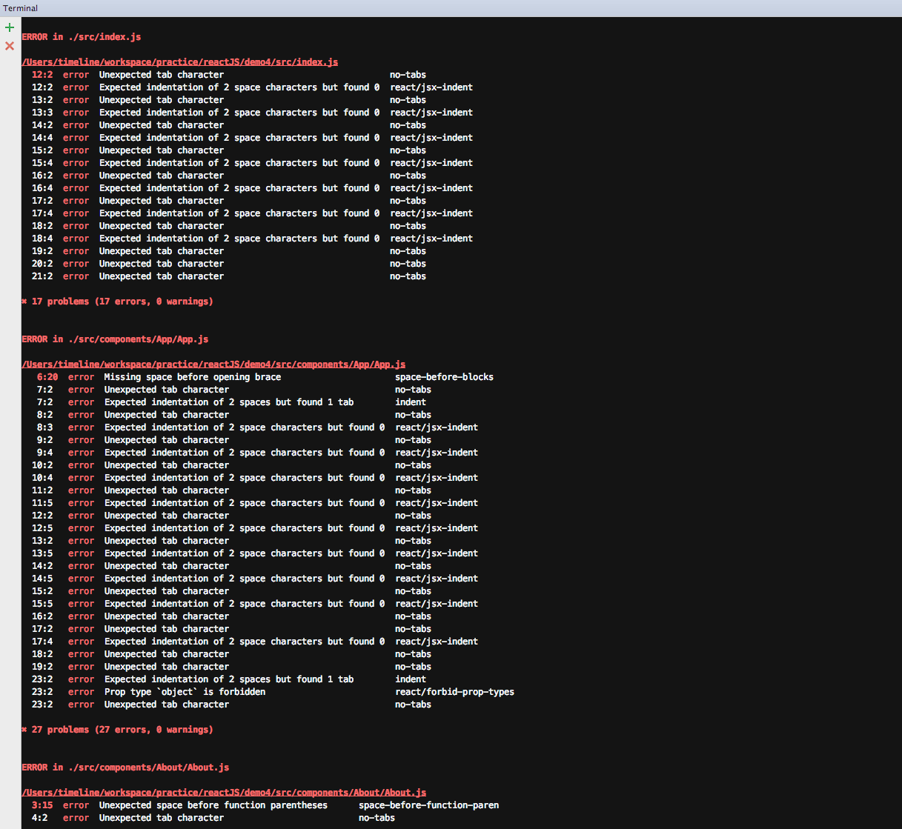
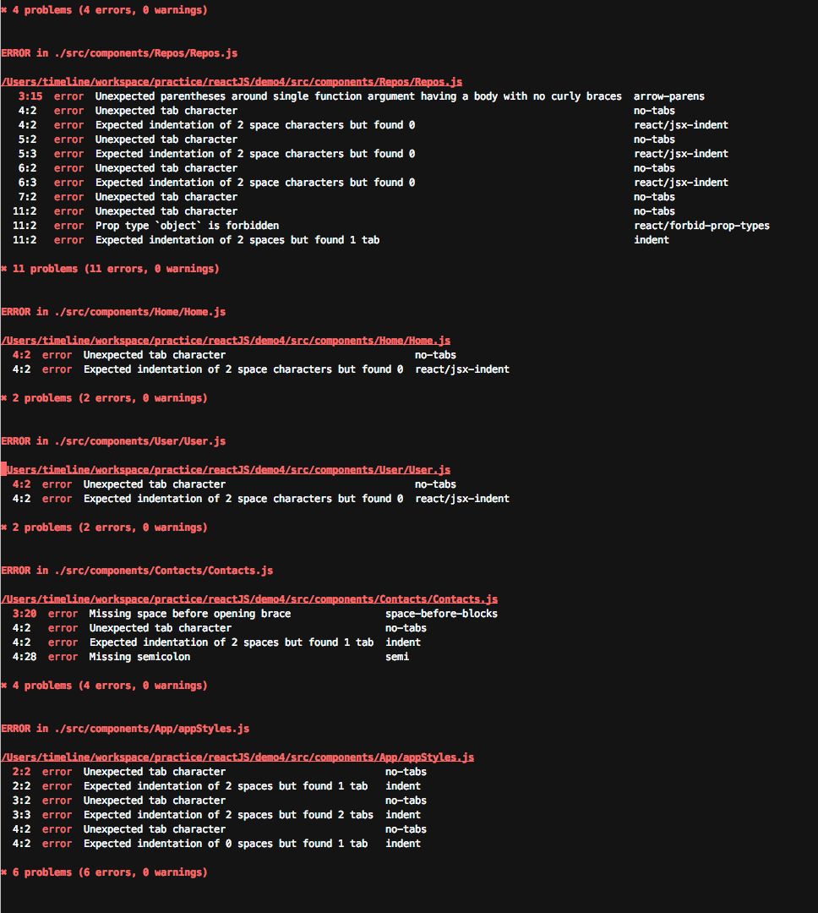
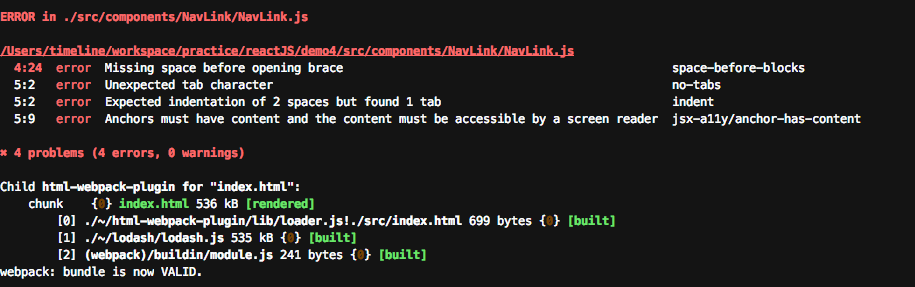

# react-router
react-router demo

最近在学习react，看了大牛们写的[ReactJS 与 Component 设计入门介绍](https://github.com/carlleton/reactjs101/tree/zh-CN)感觉学到了很多东西，竟然还有中文版的，简直良心啊！

照着第五章React-Router照打了一遍代码，还是有很多报错，主要是eslint的报错，参考了知乎[React/JSX 代码风格指南](https://zhuanlan.zhihu.com/p/21483570)这篇文章，改了部分代码格式，但是还有有空格，分号之类的报错

查了下[ESLint的rules](http://eslint.org/docs/rules/),在.eslintrrc里面把不必要的报错关掉了几个，还有几个改成了warn，终于没有error了，整个世界都清净啦！

但是里面的报错还是不知道具体怎么改,比如Expected indentation of 2 space characters but found 0 ,但是我并没有在代码中看见少空格的地方,代码和作者的例子也是一样的,编译了作者的代码完全没有报错,唉,有待继续研究

